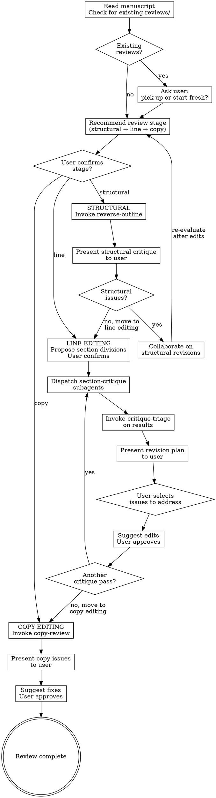

# Manuscript Review System Implementation Plan

> **For Claude:** REQUIRED SUB-SKILL: Use executing-plans to implement this plan task-by-task.

**Goal:** Build a 5-skill system for hierarchical manuscript review — structural, line, and copy editing — using adversarial critique subagents, triage synthesis, and user-guided revision.

**Architecture:** An orchestrator skill (`manuscript-review`) manages the review workflow across three stages. Four independent skills handle discrete tasks: `reverse-outline` (structural compression), `section-critique` (adversarial believing/doubting analysis), `critique-triage` (synthesis and prioritization), and `copy-review` (grammar/style checking via `style-guide`). All output persists to `reviews/YYYY-MM-DD/` alongside the manuscript. The orchestrator dispatches subagents but always returns to the user for decisions.

**Tech Stack:** Claude Code skills (SKILL.md files), subagent dispatching via Agent tool, markdown output files.

**Skill dependencies:** `style-guide` (activated by `copy-review`), `python-environment` (if any scripts needed).

---

## Implementation Order

The skills should be built bottom-up: independent leaf skills first, orchestrator last. This lets us test each component in isolation before composing them.

1. `reverse-outline` — no dependencies on other new skills
2. `section-critique` — no dependencies on other new skills
3. `critique-triage` — consumes output from `section-critique`
4. `copy-review` — activates `style-guide`
5. `manuscript-review` — orchestrates all four

---

### Task 1: Create `reverse-outline` skill directory

**Files:**
- Create: `reverse-outline/SKILL.md`

**Step 1: Write the SKILL.md**

```markdown
---
name: reverse-outline
description: Use when assessing the structural integrity of a manuscript or long-form document, when checking whether a paper's argument flows logically, or when preparing for structural revision
---

# Reverse Outline

## Overview

Compress a manuscript into a flat list of core claims to expose its logical skeleton. Each bullet captures the single essential claim of a section or paragraph in 1-2 sentences. The resulting outline is then critiqued for gaps, redundancies, logical leaps, and missing transitions.

## When to Use

- Checking whether a paper's argument flows logically end-to-end
- Preparing for structural revision before line editing
- Evaluating whether sections are in the right order
- Identifying redundant or missing sections
- Invoked by `manuscript-review` during the structural stage

## Workflow

### Step 1: Identify the manuscript

Ask the user to point to the document. Read the full document.

### Step 2: Generate the reverse outline

For each major unit of the document (section, subsection, or paragraph depending on granularity), extract the single core claim in 1-2 sentences. Output as a flat bullet list — do NOT preserve the document's section hierarchy. The flat structure makes logical flow (or breaks in it) immediately visible.

**Format:**
```
- [Claim from first unit]
- [Claim from second unit]
- [Claim from third unit]
- ...
```

Present the reverse outline to the user before proceeding to critique.

### Step 3: Critique the skeleton

Read the flat outline as a standalone argument. Evaluate:

1. **Logical flow:** Does each claim follow from the previous? Are there leaps where intermediate reasoning is missing?
2. **Gaps:** Are there claims that need to be made but aren't present? Places where the reader would ask "but what about...?"
3. **Redundancies:** Are any two bullets making essentially the same claim? Could they be merged or is one unnecessary?
4. **Ordering:** Would rearranging any bullets strengthen the argument's progression?
5. **Balance:** Are some parts of the argument developed in far more detail than others? Is that imbalance intentional or a sign of structural weakness?

Output the critique as a structured list of issues, each with:
- **Location:** Which bullet(s) are involved
- **Type:** gap | redundancy | logical-leap | ordering | balance
- **Issue:** What the problem is
- **Direction:** A brief suggestion for how to address it (not a fix — a direction)

### Step 4: Save output

Save the reverse outline and its critique to `reviews/YYYY-MM-DD/reverse-outline.md` alongside the manuscript. Create the `reviews/YYYY-MM-DD/` directory if it doesn't exist. Use today's date.

**Output format:**
```markdown
# Reverse Outline — [Document Name]

Generated: YYYY-MM-DD

## Outline

- [Claim 1]
- [Claim 2]
- ...

## Structural Critique

### 1. [Issue title]
- **Location:** Bullets N-M
- **Type:** [gap | redundancy | logical-leap | ordering | balance]
- **Issue:** [Description]
- **Direction:** [Suggestion]

### 2. ...
```

### Step 5: Present to user

Present the critique to the user. Ask whether any issues warrant structural revision before moving to line editing.

## Rules

1. **Flat list only.** Do not reproduce the document's hierarchy. The point is to see the argument stripped of its structure.
2. **One claim per bullet.** If a section makes multiple claims, it gets multiple bullets.
3. **Claims, not summaries.** Each bullet states what the text *argues*, not what it *discusses*. "Orientation tuning sharpens over 100ms post-stimulus" not "This section discusses temporal dynamics of orientation tuning."
4. **Critique is directional, not prescriptive.** Suggest directions for revision, not specific rewrites.
5. **Always save output.** Even when invoked standalone, persist to `reviews/`.

## Common Mistakes

| Mistake | Fix |
|---------|-----|
| Preserving document hierarchy in outline | Flatten to single-level list — hierarchy obscures logical leaps |
| Writing summaries instead of claims | Extract the argument, not the topic |
| Skipping critique and just presenting outline | The critique IS the value — outline alone is just compression |
| Proposing specific rewrites | Stay at the level of direction — editing is the user's decision |
```

**Step 2: Commit**

```bash
git add reverse-outline/SKILL.md
git commit -m "add reverse-outline skill for structural manuscript analysis"
```

---

### Task 2: Create `section-critique` skill directory

**Files:**
- Create: `section-critique/SKILL.md`

**Step 1: Write the SKILL.md**

```markdown
---
name: section-critique
description: Use when critically reviewing a specific section or text range of a manuscript, when performing adversarial analysis of a document's arguments, or when evaluating internal consistency and evidentiary support of scientific writing
---

# Section Critique

## Overview

Perform a thorough adversarial critique of a specific section of a manuscript. Reads the full document for context, then focuses on the target range with two passes: a believing pass (internal consistency under the text's own assertions) and a doubting pass (questioning the assertions themselves). Outputs structured critiques tagged by severity and type.

## When to Use

- Deep review of a specific section of a manuscript
- Evaluating whether a section's arguments hold up under scrutiny
- Identifying weaknesses before peer review
- Invoked by `manuscript-review` during the line editing stage

## Workflow

### Step 1: Identify the document and section

Prompt the user to point to:
1. The document (file path)
2. The text range to critique (line numbers, section heading, or other identifier)

### Step 2: Read full document for context

Read the entire document to understand:
- The overall argument and thesis
- How the target section fits into the larger structure
- What claims are made elsewhere that the target section depends on or supports

### Step 3: Re-read the target section

Re-read just the target section closely. Note specific claims, evidence cited, logical steps, and conclusions drawn.

### Step 4: Believing pass

Accept all assertions in the text as true. Under that assumption, critique only internal consistency:

- Do conclusions follow from the stated premises?
- Are there contradictions within the section?
- Does the reasoning contain logical fallacies (even granting the premises)?
- Are there claims made without any supporting argument, even internally?
- Does the section's argument align with claims made in other parts of the document?

Tag each critique with severity (`major` | `moderate` | `minor`) and type (`consistency` | `logic` | `unsupported-claim` | `contradiction`).

### Step 5: Doubting pass

Now question the assertions themselves:

- Is the evidence sufficient to support the claims? What alternative explanations exist?
- Are citations used accurately — does the cited work actually support what is claimed?
- Are there unstated assumptions that the argument depends on?
- Would a skeptical reviewer find the reasoning convincing?
- Are there known counterarguments or alternative interpretations not addressed?

Tag each critique with severity (`major` | `moderate` | `minor`) and type (`evidence` | `assumption` | `alternative-explanation` | `citation-accuracy` | `counterargument`).

### Step 6: Reference line numbers

If the document has line numbers (e.g., PDF with line numbering, or a text file), reference specific line numbers for each critique. If working from a file, reference the file line numbers. This makes critiques actionable.

### Step 7: Save output

Save to `reviews/YYYY-MM-DD/critique-{section-name}.md` alongside the manuscript. If a file with that name already exists, version it (`-v2`, `-v3`, etc.).

**Output format:**
```markdown
# Section Critique: [Section Name]

Generated: YYYY-MM-DD
Document: [file path]
Range: [line numbers or section identifier]

## Believing Pass

### 1. [Short issue title]
- **Severity:** [major | moderate | minor]
- **Type:** [consistency | logic | unsupported-claim | contradiction]
- **Location:** [line numbers or paragraph reference]
- **Critique:** [What the issue is and why it matters under the text's own assertions]

### 2. ...

## Doubting Pass

### 1. [Short issue title]
- **Severity:** [major | moderate | minor]
- **Type:** [evidence | assumption | alternative-explanation | citation-accuracy | counterargument]
- **Location:** [line numbers or paragraph reference]
- **Critique:** [What the issue is and why a skeptical reader would flag it]

### 2. ...
```

## Rules

1. **Read the whole document first.** Section-level critiques without document-level context miss cross-references, contradictions with other sections, and argument dependencies.
2. **Separate the passes.** Do not mix believing and doubting critiques. The separation forces different modes of analysis.
3. **Be thorough.** The goal is to surface all potential issues. Downstream triage handles prioritization — this skill's job is completeness.
4. **Critique, don't fix.** State what the problem is and why it matters. Do not propose rewrites or solutions.
5. **Tag everything.** Every critique gets severity and type tags. These are essential for downstream triage.
6. **Line numbers when available.** Always reference specific locations in the text.

## Common Mistakes

| Mistake | Fix |
|---------|-----|
| Skipping the full-document read | Always read the whole document first — context matters |
| Mixing believing and doubting critiques | Keep passes separate — they require different analytical modes |
| Proposing fixes instead of critiques | State the issue, not the solution — editing happens later |
| Being vague about location | Reference specific lines, paragraphs, or sentences |
| Softening critiques to be "nice" | Thoroughness serves the author — honest critique improves the work |
| Skipping minor issues | Log everything — triage decides what matters, not critique |
```

**Step 2: Commit**

```bash
git add section-critique/SKILL.md
git commit -m "add section-critique skill for adversarial manuscript section analysis"
```

---

### Task 3: Create `critique-triage` skill directory

**Files:**
- Create: `critique-triage/SKILL.md`

**Step 1: Write the SKILL.md**

```markdown
---
name: critique-triage
description: Use when synthesizing and prioritizing critiques from multiple section reviews, when planning manuscript revisions from collected feedback, or when deciding which issues to address first after a round of critique
---

# Critique Triage

## Overview

Synthesize critiques from multiple `section-critique` outputs (or any structured critique files) into a deduplicated, prioritized revision plan. Identifies patterns across sections, flags issues that escalate to structural problems, and presents a ranked list of revision priorities for the user to approve.

## When to Use

- After running `section-critique` on multiple sections
- When you have accumulated critique files and need to decide what to act on
- When planning a revision pass based on collected feedback
- Invoked by `manuscript-review` after the line editing critique phase

## Workflow

### Step 1: Locate critique files

By default, consume all `critique-*.md` files in the current `reviews/YYYY-MM-DD/` directory. If the user wants to filter (e.g., only triage critiques from specific sections), ask which files to include.

### Step 2: Read and parse all critiques

Read each critique file. Extract all individual critiques with their metadata (severity, type, location, section).

### Step 3: Deduplicate

Identify critiques across different sections that describe the same underlying issue. For example:
- Section A and Section C both note that a key term is used inconsistently
- Multiple sections flag that a particular citation doesn't support the claim made

Group duplicates and note which sections they appear in — recurrence across sections increases the issue's priority.

### Step 4: Cluster by theme

Group related (but not duplicate) critiques into thematic clusters:
- All critiques about evidentiary support
- All critiques about internal consistency
- All critiques about unstated assumptions
- All critiques about a specific claim or finding

### Step 5: Identify structural escalations

Some line-level critiques, when viewed together, reveal structural problems:
- Multiple sections making the same logical leap suggests a missing section
- Contradictions between sections suggest a structural reorganization is needed
- A cluster of "unsupported claim" critiques in the same area suggests a gap in the argument

Flag these explicitly as **structural escalations** — they may warrant returning to the structural editing stage.

### Step 6: Rank and prioritize

Rank all issues (deduplicated, clustered, and escalated) by:
1. **Structural escalations** — highest priority, address before line edits
2. **Major severity issues** — especially those appearing in multiple sections
3. **Moderate severity** — especially thematic clusters
4. **Minor severity** — individual minor issues

### Step 7: Present revision plan

Present the prioritized list to the user as a revision plan. For each item:
- What the issue is
- Where it appears (sections, line numbers)
- Whether it's a structural escalation or a line-level issue
- Suggested direction for revision (not specific edits)

### Step 8: Save output

Save to `reviews/YYYY-MM-DD/triage.md`.

**Output format:**
```markdown
# Critique Triage

Generated: YYYY-MM-DD
Sources: [list of critique files consumed]

## Structural Escalations

### 1. [Issue title]
- **Sections affected:** [list]
- **Underlying problem:** [description]
- **Direction:** [suggestion]

## Major Issues

### 1. [Issue title]
- **Severity:** major
- **Sections:** [where it appears]
- **Critique summary:** [consolidated description]
- **Direction:** [suggestion]

## Moderate Issues
...

## Minor Issues
...

## Statistics
- Total critiques processed: N
- Duplicates removed: N
- Structural escalations: N
- Major: N | Moderate: N | Minor: N
```

## Rules

1. **Consume all critique files by default.** Only filter when the user explicitly asks.
2. **Deduplicate aggressively.** The same issue flagged in multiple sections should appear once with all locations noted.
3. **Escalate when warranted.** Patterns of line-level issues that indicate structural problems must be flagged — this is the triage's highest-value output.
4. **Direction, not prescription.** Like the critique skills, suggest directions for revision, not specific rewrites.
5. **Always save output.** Persist to `reviews/` even when invoked standalone.

## Common Mistakes

| Mistake | Fix |
|---------|-----|
| Listing all critiques without deduplication | The whole point is synthesis — merge duplicates |
| Missing structural escalations | Look for patterns across sections, not just within them |
| Ranking by count instead of impact | A single major issue outranks ten minor ones |
| Proposing specific edits | Stay at the direction level — the user and orchestrator handle editing |
| Ignoring cross-section contradictions | These are the most valuable finds — always flag them |
```

**Step 2: Commit**

```bash
git add critique-triage/SKILL.md
git commit -m "add critique-triage skill for synthesizing and prioritizing review critiques"
```

---

### Task 4: Create `copy-review` skill directory

**Files:**
- Create: `copy-review/SKILL.md`

**Step 1: Write the SKILL.md**

```markdown
---
name: copy-review
description: Use when checking a manuscript for grammar, punctuation, terminology consistency, and stylistic issues, or when performing a final polish pass before submission
---

# Copy Review

## Overview

Perform a copy-level review of a manuscript, checking for grammar, syntax, punctuation, terminology consistency, and stylistic issues. Activates the `style-guide` skill for stylistic compliance. Operates at the paragraph level, dispatching subagents for parallel review when the document is large.

## When to Use

- Final polish pass before submission
- Checking grammar and punctuation after substantive edits
- Ensuring terminology consistency across a document
- Invoked by `manuscript-review` during the copy editing stage

## Workflow

### Step 1: Identify the manuscript

Ask the user to point to the document. Read the full document.

### Step 2: Activate style guide

**REQUIRED SUB-SKILL:** Use `style-guide` to establish voice standards and the blacklist for this review.

### Step 3: Divide into review units

Divide the document into paragraph-level review units. If the document would produce more than 10 review units, batch adjacent paragraphs into larger chunks (aim for 5-10 chunks).

### Step 4: Review each unit

For each review unit, check:

1. **Grammar and syntax:** Subject-verb agreement, tense consistency, sentence fragments, run-on sentences, dangling modifiers.
2. **Punctuation:** Comma usage, semicolons, colons, quotation marks, hyphens vs. em-dashes.
3. **Terminology consistency:** Are the same concepts referred to with the same terms throughout? Flag any term that appears in multiple forms (e.g., "receptive field" vs. "RF" without prior definition of the abbreviation).
4. **Style guide compliance:** Apply the `style-guide` blacklist and voice principles. Flag any violations.
5. **Reference formatting:** Are citations, figure references, and cross-references formatted consistently?
6. **Line numbers:** Reference specific line numbers when available.

### Step 5: Compile results

Collect all issues into a single output document. For each issue:
- **Location:** Line number or paragraph reference
- **Type:** grammar | punctuation | terminology | style | reference-format
- **Issue:** What the problem is
- **Suggestion:** Specific fix (unlike critique skills, copy-level issues have clear right answers)

### Step 6: Save output

Save to `reviews/YYYY-MM-DD/copy-review.md`.

**Output format:**
```markdown
# Copy Review

Generated: YYYY-MM-DD
Document: [file path]
Style guide: applied

## Issues

### 1. [Short description]
- **Location:** [line/paragraph]
- **Type:** [grammar | punctuation | terminology | style | reference-format]
- **Issue:** [description]
- **Suggestion:** [specific fix]

### 2. ...

## Terminology Consistency Report

| Term | Variants Found | Recommended |
|------|---------------|-------------|
| [term] | [variant1, variant2] | [recommended form] |

## Statistics
- Total issues: N
- Grammar: N | Punctuation: N | Terminology: N | Style: N | Reference: N
```

## Rules

1. **Always activate `style-guide`.** Copy review without the style guide is incomplete.
2. **Suggest specific fixes.** Unlike structural and line critique, copy issues have determinate solutions.
3. **Flag terminology inconsistency across the whole document.** This requires document-level awareness, not just paragraph-level.
4. **Don't re-litigate content.** Copy review is about form, not substance. If a claim is wrong, that's a `section-critique` issue, not a copy issue.
5. **Always save output.** Persist to `reviews/`.

## Common Mistakes

| Mistake | Fix |
|---------|-----|
| Critiquing content instead of form | Copy review is grammar/style only — substance belongs to section-critique |
| Skipping style-guide activation | Always activate — it defines what "correct" style means |
| Missing cross-document terminology inconsistency | Build the terminology table from the whole document, not section by section |
| Not providing specific fixes | Copy issues have clear solutions — provide them |
```

**Step 2: Commit**

```bash
git add copy-review/SKILL.md
git commit -m "add copy-review skill for grammar, style, and terminology checking"
```

---

### Task 5: Create `manuscript-review` orchestrator skill

**Files:**
- Create: `manuscript-review/SKILL.md`

**Step 1: Write the SKILL.md**

```markdown
---
name: manuscript-review
description: Use when reviewing and editing a manuscript or long-form document, when performing a systematic multi-stage review (structural, line, copy), or when preparing a paper for submission through iterative critique and revision
---

# Manuscript Review

## Overview

Orchestrate the full review and editing cycle for a manuscript. Guides the user through three hierarchical stages — structural, line, and copy editing — using adversarial critique subagents, synthesis, and collaborative revision. The orchestrator manages the conversation; the user makes all editing decisions.

## When to Use

- Reviewing a manuscript draft before submission
- Systematic editing of a paper, grant, or long-form document
- User wants structured feedback on a piece of writing
- User wants to improve a document through iterative critique and revision

## Stage Hierarchy

Structural issues must be resolved before line editing. Line editing must settle before copy editing. Addressing lower-level issues while higher-level problems exist wastes effort — entire sections may be cut or reorganized.



## Workflow

### Session Start

1. Ask the user to point to the manuscript (file path).
2. Read the manuscript.
3. Check for existing `reviews/` directory alongside the manuscript.
   - If reviews exist: ask the user whether to pick up where they left off or start fresh.
   - If starting fresh: create a new `reviews/YYYY-MM-DD/` directory.
4. Assess the manuscript's current state and recommend a review stage:
   - **Structural:** The argument's architecture may have issues — recommend starting here for early drafts or documents that haven't been structurally reviewed.
   - **Line editing:** Structure seems sound — focus on section-level argument quality.
   - **Copy editing:** Content is solid — focus on polish.
5. Present recommendation to the user. User confirms or overrides.

### Structural Stage

1. Invoke `reverse-outline` on the manuscript (dispatch as subagent).
2. Present the reverse outline and structural critique to the user.
3. If structural issues are identified:
   - Discuss with the user which issues to address.
   - Suggest specific structural revisions (reordering, cutting, adding sections).
   - User approves or modifies the suggestions.
   - After edits are made, re-evaluate: run another structural pass or move to line editing.
4. If no structural issues: move to line editing.

### Line Editing Stage

1. **Propose section divisions.** Analyze the manuscript and propose logical divisions that span distinct ideas. These don't need to match the document's section headers — they should reflect the natural boundaries of the argument. Present to the user for confirmation and adjustment.

2. **Dispatch `section-critique` subagents.** For each confirmed section, dispatch a subagent with:
   - The full document (for context)
   - The specific text range to focus on
   - Instructions to perform believing and doubting passes

3. **Triage.** Once all critique subagents return, invoke `critique-triage` to synthesize results.

4. **Present revision plan.** Show the triaged, prioritized revision plan to the user.
   - If triage identifies **structural escalations**: recommend returning to the structural stage.
   - Otherwise: walk through issues by priority.

5. **Collaborative editing.** For each issue the user wants to address:
   - Suggest a specific edit to the manuscript text.
   - User approves, modifies, or rejects.
   - Apply approved edits.

6. **Iterate if needed.** After a round of edits, ask the user if they want another critique pass on the edited sections. If yes, dispatch new `section-critique` subagents (output versioned `-v2`, etc.) and re-triage.

7. **Move to copy editing** when the user is satisfied with the line-level review.

### Copy Editing Stage

1. Invoke `copy-review` on the manuscript (dispatch as subagent).
   - `copy-review` will activate `style-guide` internally.
2. Present copy issues to the user.
3. For each issue:
   - Suggest specific fix.
   - User approves or rejects.
   - Apply approved fixes.
4. Review complete.

### Non-Editable Documents

If the manuscript is a non-editable format (PDF, image):
- Follow the same critique workflow (structural, line, copy).
- Instead of suggesting edits to the file, generate a **revision summary** document saved to `reviews/YYYY-MM-DD/revision-summary.md` with all findings organized by stage and priority.
- The user can then apply revisions to the source document manually.

## Subagent Dispatch

When dispatching subagents, provide:
1. The full document text (or path for the subagent to read)
2. The specific task (which skill to invoke, what section to focus on)
3. The output path for saving results

For line editing, dispatch section-critique subagents in parallel when possible. If more than 10 subagents would be needed, batch adjacent sections.

## Rules

1. **Never edit without user approval.** Every edit is suggested, then confirmed.
2. **Respect the hierarchy.** Don't start line editing until structural issues are resolved. Don't copy edit until line editing is settled.
3. **Always save outputs.** All critique, triage, and review artifacts go to `reviews/YYYY-MM-DD/`.
4. **User drives the conversation.** The orchestrator recommends; the user decides. This applies to stage selection, issue prioritization, and edit approval.
5. **One stage at a time.** Don't mix structural critique with copy editing suggestions.
6. **Escalate when triage says to.** If critique-triage identifies structural escalations during line editing, recommend returning to structural review.

## Skill Dependencies

- `reverse-outline` — structural analysis (dispatched as subagent)
- `section-critique` — adversarial section critique (dispatched as subagent, potentially in parallel)
- `critique-triage` — synthesis and prioritization (dispatched as subagent or inline)
- `copy-review` — copy editing (dispatched as subagent)
- `style-guide` — activated by `copy-review`

## Common Mistakes

| Mistake | Fix |
|---------|-----|
| Jumping to copy editing on an early draft | Start with structural review — don't polish text that might be cut |
| Editing without asking the user | Every edit needs user approval — suggest, don't apply |
| Ignoring structural escalations from triage | If triage says structure is broken, go back to structural stage |
| Dispatching too many parallel subagents | Batch sections if >10 subagents would be needed |
| Not checking for existing reviews | Always check on session start — offer to resume |
| Mixing critique levels in one pass | Keep structural, line, and copy editing strictly separate |
```

**Step 2: Commit**

```bash
git add manuscript-review/SKILL.md
git commit -m "add manuscript-review orchestrator skill for hierarchical document review"
```

---

### Task 6: Register all new skills in skills-prelude

**Files:**
- Modify: `skills-prelude/SKILL.md` (no modification needed — skills are auto-discovered from the skill directory)

**Step 1: Verify auto-discovery**

Check that Claude Code discovers skills from `~/.claude/skills/` automatically by checking how existing skills are registered. If skills-prelude requires manual registration, add entries for all 5 new skills.

**Step 2: Verify skill descriptions appear in the system reminder**

Start a new Claude Code session and confirm all 5 skills appear in the available skills list.

---

### Task 7: Write test scenarios for each skill (TDD — RED phase)

Per the `writing-skills` skill, each skill must be tested with subagent pressure scenarios before deployment. This task creates the baseline tests.

**Files:**
- Create test scenarios in a temporary working document (not committed — ephemeral)

**Step 1: Test `reverse-outline` (RED)**

Create a short test manuscript (~500 words) with known structural issues:
- A logical leap between paragraphs 2 and 3
- A redundant claim in paragraphs 1 and 5
- A missing transition

Dispatch a subagent WITHOUT the skill to reverse-outline the test manuscript. Document:
- Did it flatten to a single-level list or preserve hierarchy?
- Did it extract claims or write summaries?
- Did it catch the planted structural issues?
- Did it save output to the correct location?

**Step 2: Test `section-critique` (RED)**

Use the same test manuscript. Select a section with:
- An internal contradiction (believing pass should catch)
- An unsupported assertion (doubting pass should catch)

Dispatch a subagent WITHOUT the skill. Document:
- Did it separate believing and doubting passes?
- Did it tag critiques with severity and type?
- Did it read the full document first?
- Did it reference line numbers?

**Step 3: Test `critique-triage` (RED)**

Create 2-3 mock critique files with overlapping issues. Dispatch a subagent WITHOUT the skill. Document:
- Did it deduplicate?
- Did it identify structural escalations?
- Did it rank by impact?

**Step 4: Test `copy-review` (RED)**

Create a short text with planted errors:
- Subject-verb disagreement
- Inconsistent terminology
- A style-guide blacklist violation

Dispatch a subagent WITHOUT the skill. Document baseline behavior.

**Step 5: Test `manuscript-review` (RED)**

Give a subagent a manuscript and ask it to "review this paper." Without the skill, document:
- Did it follow a hierarchical approach?
- Did it separate stages?
- Did it ask user for approval before editing?

---

### Task 8: Run GREEN tests and iterate (REFACTOR)

**Step 1:** Run each test scenario WITH the corresponding skill loaded. Verify the skill addresses the baseline failures.

**Step 2:** Identify any new rationalizations or failure modes. Add explicit counters to the skill documents.

**Step 3:** Re-test until each skill reliably produces the expected behavior.

**Step 4: Commit final versions**

```bash
git add reverse-outline/ section-critique/ critique-triage/ copy-review/ manuscript-review/
git commit -m "finalize manuscript review skills after TDD verification"
```

---

## Execution Notes

- Tasks 1-5 can be implemented sequentially (they build on each other conceptually but are independently deployable).
- Task 6 is a verification step — may require no code changes.
- Tasks 7-8 are the TDD cycle — run these before considering the skills "done."
- All skills save to `reviews/YYYY-MM-DD/` alongside the manuscript, not in the skills repo.
