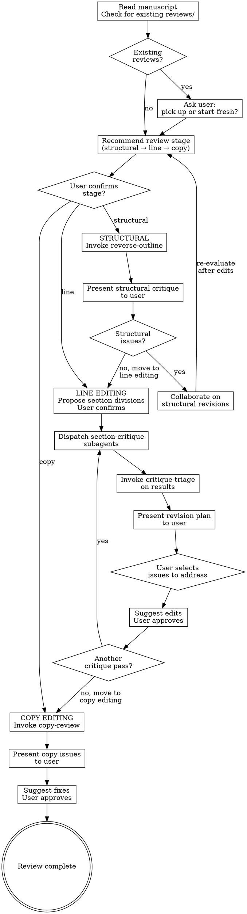

# Manuscript Review

## Overview

Orchestrate the full review and editing cycle for a manuscript. Guides the user through three hierarchical stages — structural, line, and copy editing — using adversarial critique subagents, synthesis, and collaborative revision. The orchestrator manages the conversation; the user makes all editing decisions.

## When to Use

- Reviewing a manuscript draft before submission
- Systematic editing of a paper, grant, or long-form document
- User wants structured feedback on a piece of writing
- User wants to improve a document through iterative critique and revision

## Stage Hierarchy

Structural issues must be resolved before line editing. Line editing must settle before copy editing. Addressing lower-level issues while higher-level problems exist wastes effort — entire sections may be cut or reorganized.

## Workflow

### Session Start

1. Ask the user to point to the manuscript (file path).
2. Read the manuscript.
3. Check for existing `reviews/` directory alongside the manuscript.
   - If reviews exist: ask the user whether to pick up where they left off or start fresh.
   - If starting fresh: create a new `reviews/YYYY-MM-DD/` directory.
4. Ask the user which review stage to start with:
   - **Structural:** Best for early drafts or documents that haven't been structurally reviewed.
   - **Line editing:** For documents with sound structure that need section-level argument review.
   - **Copy editing:** For documents with solid content that need polish.
5. The user selects the stage. If the user is unsure, suggest starting with structural — it's always safe to confirm the structure is sound before moving deeper.

### Structural Stage

The structural stage is exclusively about architecture: argument flow, logical gaps, section organization, redundancy, and balance. It is NOT about minor issues (typos, grammar, formatting, citation errors). Those belong to later stages. Structural review is a heavy synthesis task — all cognitive effort should go toward holding the full argument in mind and evaluating its skeleton. Reporting minor issues wastes that effort and muddies the review's value.

1. Invoke `reverse-outline` on the manuscript (dispatch as subagent).
2. Present the reverse outline and structural critique to the user.
3. If structural issues are identified:
   - Discuss with the user which issues to address.
   - Suggest specific structural revisions (reordering, cutting, adding sections).
   - User approves or modifies the suggestions.
   - After edits are made, re-evaluate: run another structural pass or move to line editing.
4. If no structural issues: move to line editing.

### Line Editing Stage

1. **Propose section divisions.** Analyze the manuscript and propose logical divisions that span distinct ideas. These don't need to match the document's section headers — they should reflect the natural boundaries of the argument. Include the abstract, title, and individual figures/tables as separate reviewable units. Present to the user for confirmation and adjustment.

2. **Dispatch `section-critique` subagents.** For each confirmed section, dispatch a subagent with:
   - The full document (for context)
   - The specific text range to focus on
   - Instructions to perform internal and external critique passes

3. **Triage.** Once all critique subagents return, invoke `critique-triage` to synthesize results.

4. **Present revision plan.** Show the triaged, prioritized revision plan to the user.
   - If triage identifies **structural escalations**: recommend returning to the structural stage.
   - Otherwise: walk through issues by priority.

5. **Collaborative editing.** For each issue the user wants to address:
   - Suggest a specific edit to the manuscript text.
   - User approves, modifies, or rejects.
   - Apply approved edits.

6. **Iterate if needed.** After a round of edits, ask the user if they want another critique pass on the edited sections. If yes, dispatch new `section-critique` subagents (output versioned `-v2`, etc.) and re-triage.

7. **Move to copy editing** when the user is satisfied with the line-level review.

### Copy Editing Stage

1. Invoke `copy-review` on the manuscript (dispatch as subagent).
   - `copy-review` will activate `style-guide` internally.
2. Present copy issues to the user.
3. For each issue:
   - Suggest specific fix.
   - User approves or rejects.
   - Apply approved fixes.
4. Review complete.

### Non-Editable Documents

If the manuscript is a non-editable format (PDF, image):
- Follow the same critique workflow (structural, line, copy).
- Instead of suggesting edits to the file, generate a **revision summary** document saved to `reviews/YYYY-MM-DD/revision-summary.md` with all findings organized by stage and priority.
- The user can then apply revisions to the source document manually.

## Subagent Dispatch

When dispatching subagents, provide:
1. The full document text (or path for the subagent to read)
2. The specific task (which skill to invoke, what section to focus on)
3. The output path for saving results

For line editing, dispatch section-critique subagents in parallel when possible. If more than 10 subagents would be needed, batch adjacent sections.

## Rules

1. **Never edit without user approval.** Every edit is suggested, then confirmed.
2. **Respect the hierarchy.** Don't start line editing until structural issues are resolved. Don't copy edit until line editing is settled.
3. **Always save outputs.** All critique, triage, and review artifacts go to `reviews/YYYY-MM-DD/`.
4. **User drives the conversation.** The orchestrator recommends; the user decides. This applies to stage selection, issue prioritization, and edit approval.
5. **One stage at a time.** Don't mix structural critique with copy editing suggestions.
6. **Escalate when triage says to.** If critique-triage identifies structural escalations during line editing, recommend returning to structural review.

## Skill Dependencies

- `reverse-outline` — structural analysis (dispatched as subagent)
- `section-critique` — adversarial section critique (dispatched as subagent, potentially in parallel)
- `critique-triage` — synthesis and prioritization (dispatched as subagent or inline)
- `copy-review` — copy editing (dispatched as subagent)
- `style-guide` — activated by `copy-review`, or activated directly whenever the orchestrator suggests text edits to the user.

## Common Mistakes

| Mistake | Fix |
|---------|-----|
| Jumping to copy editing on an early draft | Start with structural review — don't polish text that might be cut |
| Editing without asking the user | Every edit needs user approval — suggest, don't apply |
| Ignoring structural escalations from triage | If triage says structure is broken, go back to structural stage |
| Dispatching too many parallel subagents | Batch sections if >10 subagents would be needed |
| Not checking for existing reviews | Always check on session start — offer to resume |
| Mixing critique levels in one pass | Keep structural, line, and copy editing strictly separate |
| Reporting typos/grammar in structural review | Structural review is architecture only — minor issues belong to copy editing |
