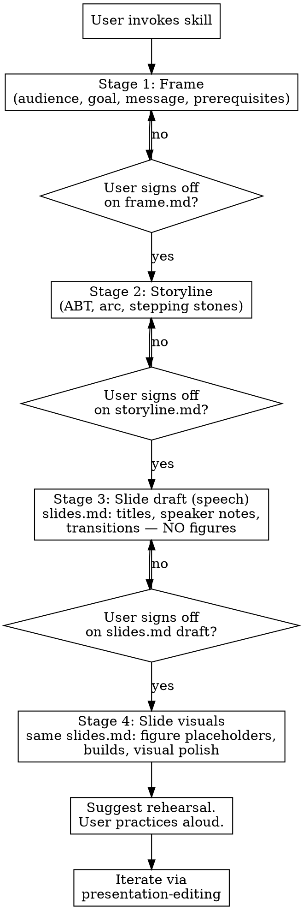

# Presentation Planning

## Overview

Develop a scientific talk through four sequential, reviewable stages — **Frame → Storyline → Slide draft (speech) → Slides (visuals)** — producing an artifact at each stage. The slide deck is the *last* artifact, not the first, and it is built in two passes: first the structure and spoken flow (titles, speaker notes, transitions) with no figures, then the visuals layered on top.

**Core principle: the talk is not the slides.** The talk is a spoken performance the speaker will rehearse; the slides are visual aids that support it. Skipping straight to slides optimizes the wrong artifact and produces word-heavy decks that duplicate what the speaker will say instead of supplementing it.

This skill is designed to be **collaborative by construction**: each stage ends at a checkpoint where the user reviews and refines the artifact before the next stage begins. No stage may be skipped, and no later stage may begin until the previous artifact exists and the user has signed off.

## When to Use

- User is preparing a scientific presentation and mentions Marp, slides, a talk, a seminar, a defense
- User has findings/results they need to turn into a talk
- User complains LLM-generated slides were word-heavy, non-collaborative, or template-y
- User wants to iterate on narrative/framing independently of slide design
- User is revising a talk they've given before for a new audience

**Don't use when:**
- User wants pure slide editing on an existing polished deck → `presentation-editing`
- User wants a critique of an existing deck → `presentation-review`
- User asks a one-off question about presentation technique (fonts, colors, timing) → answer directly, don't invoke the full skill

## The Iron Rule

**No slides until the prior stages have written artifacts.** Even if the user dumps a complete set of findings into the first message, even if they say "just give me a draft," do not skip Frame and Storyline. The things those stages capture — audience composition, goal, one-sentence core message, prerequisite knowledge the audience lacks — are the things the user has not articulated yet. A slide draft written without them will not be a useful stepping stone, it will be a distractor.

If the user pushes back with "I know the audience, just draft the slides," respond with the Frame questions as a single short interview (2–3 minutes of the user's time). The Frame file is then written from their answers. This is not bureaucracy — it is the difference between iterating on a talk and iterating on a document.

### First-turn discipline

**Your entire first-turn output is the Stage 1 Frame interview. Nothing else.** Do not additionally:

- Summarize your read of the user's message back to them.
- Propose a file layout or directory structure.
- Offer a tentative outline, slide count, or slide list "to calibrate expectations."
- Pre-fill the core-message sentence for the user. (They must write it themselves. If they cannot, that is *diagnostic* of the Frame not being done — do not paper over it by supplying a starter they can nod at.)
- Draft any slide, even as an illustrative example.

Adding "something tangible alongside the questions" is the most common first-turn loophole. Close it by giving nothing tangible until the Frame is signed off.

## Artifacts

All files live in a user-specified presentation directory (default: `./presentation/`). Ask the user at Frame-stage start where to save them and what the presentation is called.

| File | Stage | Content |
|------|-------|---------|
| `frame.md` | 1 | Audience composition, goal, one-sentence core message, prerequisite knowledge map |
| `storyline.md` | 2 | ABT core statement, narrative arc (hook → conflict → resolution), ordered beats with stepping stones that earn each prerequisite |
| `slides.md` | 3 | Marp markdown: slide titles (short clauses), speaker notes and transitions as HTML comments, **no figures yet** — figure slots marked with a `FIGURE:` description comment |
| `slides.md` | 4 | Same file, second pass: figure placeholders (``), progressive-reveal markers, visual polish |
| `rehearsal-notes.md` | post-4 | User-written record of what felt off during rehearsal; seeds the next edit pass |

Stages 3 and 4 are two passes over the same `slides.md`. This is deliberate: the first pass fixes the spoken structure of the talk (what the speaker says, in what order, with what transitions); the second pass fits visuals to that structure. Maintaining a separate per-slide "assertion list" file in parallel duplicates `slides.md` and drifts out of sync, so there is no separate artifact for it.

## Core Loop



## Stages

Each stage has its own reference guide. Read the relevant reference before starting a stage.

### Stage 1: Frame
**Output:** `frame.md`

Interview the user to capture four things. Use `references/frame-guide.md` for the full elicitation script.

1. **Audience composition** — not "faculty" but "who specifically sits in the room; which subfields; which are expert vs. generalist in *this* topic."
2. **Goal** — what the user wants this talk to accomplish (job talk signaling, thesis committee buy-in, collaborator recruitment, etc.).
3. **Core message** — one sentence the user wants every audience member to remember. If the user can't state it, the talk isn't ready — iterate until they can.
4. **Prerequisite knowledge map** — the minimum set of concepts the audience must hold to land the core message. For each concept: does the audience already have it, or must the talk build it? The build list feeds directly into Stage 2.

### Stage 2: Storyline
**Output:** `storyline.md`

Read `references/storyline-guide.md`. Produce:

1. **ABT core statement** (AND / BUT / THEREFORE — Olson, via Crivellaro).
2. **Arc outline** — hook, conflict, resolution, meaning. The resolution decomposes into one or more "data dives," each a mini-argument (sub-question → one piece of evidence → one-sentence result → bridge). Let the core claim's structure determine the count — one dive if the talk rests on a single body of evidence, more as the argument actually splits. Do not hit a 3–5 quota just because it is typical.
3. **Stepping stones** — for each prerequisite from the Frame, specify *where in the narrative it gets earned as forward motion*, not as "Background" filler. Every concept the audience will encounter must be introduced as a step of the argument before it is relied on.
4. **Order check** — does the narrative run chronologically ("we did X, then Y failed, so we did Z")? If yes, re-plan. Lab-notebook order is the #1 failure mode; flashback/novel order holds attention.

### Stage 3: Slide draft — structure and speech
**Output:** `slides.md` (first pass — no figures yet)

Read `references/marp-conventions.md`. Convert the storyline into a Marp skeleton focused on the **spoken performance**, not visuals. Each slide gets:

| Field | Content |
|-------|---------|
| Title | A short, direct clause — a noun phrase or compact sentence fragment, usually 3–8 words. One line on the slide; never wrapping to a second line except for rare deliberate effect. Non-colloquial. ("Perisaccadic RF anisotropy", not "LGN RFs get elongated when the eye moves") |
| Figure slot | An HTML-comment `FIGURE:` description: what the figure should show, what axes, what the audience should look at first. No image tag yet. |
| Transition in | One sentence the speaker says *before* this slide — in a `TRANSITION IN:` line inside the speaker-notes comment |
| Transition out | One sentence the speaker says *moving to* the next slide — in a `TRANSITION OUT:` line |
| Speaker notes | 2–4 bullets in the comment: specific phrasing, key numbers, pacing cues, skeptic pre-empts |

One message per slide. If a slide is carrying two takeaways, split it.

**Copy the locked-in visual style at the start of Stage 3** (the theme is needed the moment `slides.md` exists, even without figures, so rendering and layout work can be previewed):

```
cp -r <skill-dir>/assets/themes  <presentation-dir>/themes
cp    <skill-dir>/assets/marprc.yml.template  <presentation-dir>/.marprc.yml
```

See the **Locked-in visual style** section below. Do not re-author any of this.

### Stage 4: Slide visuals
**Output:** same `slides.md`, second pass

Now layer visuals on top of the spoken structure:

- Replace each `FIGURE:` comment with a placeholder image tag: ``. Keep the description as a comment directly below the tag so the user knows what to produce.
- Add progressive-reveal markers where the storyline calls for build-up: duplicate slides (Pattern A) or annotate with `<!-- BUILD: ... -->` comments (Pattern B). See `references/marp-conventions.md`.
- Check sizing hints, per-slide class directives (dark backgrounds for microscopy, etc.), and the summary/acknowledgments slides.
- Do not invent figure content. Every figure is a placeholder the user will fill in.

After Stage 4, **suggest** (do not require) that the user rehearse the talk out loud, time it, and note what felt off. This seeds `rehearsal-notes.md` and the next edit pass via `presentation-editing`.

## Rationalizations That Skip Stages

From baseline testing, these are the specific arguments a capable LLM uses to skip Frame and Storyline. Do not accept them.

| Rationalization | Reality |
|-----------------|---------|
| "The user gave enough detail to draft slides." | The detail they gave is raw material. The things Frame captures — audience, goal, core message, prerequisite map — are things they haven't articulated yet, not things they left out of the prompt. |
| "They asked for a first-pass draft to iterate on." | A slide draft without a storyline is not a stepping stone — it is a distractor that shifts iteration onto slide-level details before the narrative is settled. |
| "I can infer the audience from the context." | You cannot infer which *subset* of the audience is expert in the user's specific subfield. Ask. |
| "I'll produce slides and they'll tell me what to change." | The user explicitly asked for a collaborative process. Slides-then-edit is the failure mode they're trying to escape. |
| "Frame takes too long — just start." | Frame is 4 questions. It takes the user 3 minutes. The talk takes a month. |
| "The ABT statement is obvious from the abstract." | If the user hasn't said it, it isn't settled. Make them say it. Offering a starter they can rubber-stamp is the same failure in a softer wrapper. |
| "Holding the reply for questions trades user momentum for process purity." | User momentum on the wrong artifact is worse than a 3-minute pause to set the right one. The questions *are* the momentum. |
| "I can ask the questions *and* draft a rough deck as a courtesy." | The hybrid move. No. The deck is what the Frame answers will reshape; drafting it now produces work to throw away and anchors the user to your structure. |

## Red Flags — Stop and Restart the Current Stage

- You wrote a slide before `storyline.md` exists.
- You wrote an outline that starts "Background:" or "Methods:" or proceeds in experiment chronology.
- A slide title is a vague catch-all ("Results", "Benchmarks") or a full declarative sentence that wraps to two lines ("Protein X represses Gene Y in postmitotic neurons, as shown by qPCR"). Aim for a short directive clause ("Protein X represses Gene Y").
- A slide has more than one takeaway.
- A concept appears on a slide without having been earned earlier in the storyline.
- There are no speaker notes.
- You added figure placeholders during Stage 3 (visuals belong to Stage 4).

## Common Mistakes

| Mistake | Fix |
|---------|-----|
| Collapsing Frame and Storyline into one dialog | Two separate artifacts. The Frame settles constraints; the Storyline spends them. Mixing them loses the constraint check. |
| Writing prose in `storyline.md` | Bullets and one-sentence beats. Prose belongs in rehearsal, not planning. |
| Inventing figure content in `slides.md` | Placeholders only. The user supplies actual figures. |
| Adding a "Background" slide | Prerequisites are earned as stepping stones within the forward narrative, not dumped as setup. Rework the storyline. |
| Forgetting speaker notes | Notes are a first-class output at Stage 3, not an afterthought. |
| Writing full-sentence slide titles that wrap to a second line | Short directive clauses. A 3–8 word noun phrase or fragment. Declarative sentences are for the *storyline* and the *spoken transitions*, not the visible title. The rare exception — a deliberate rhetorical headline — is reserved for high-stakes landing slides. |
| Maintaining a separate per-slide assertion file in parallel with `slides.md` | Don't. The slide file is the per-slide record; drifting two files out of sync is the failure mode. Put speaker notes and transitions in HTML comments on each slide. |
| Prescribing home slides universally | Home slides help long talks with clearly separable sections. For shorter or single-thread talks, verbal signposting suffices. Use the principle, not the device. |
| Auto-rehearsing for the user | Rehearsal is the user's job. The skill suggests, does not block. |

## Skill Dependencies

- `presentation-editing` — hand off after `slides.md` exists and user has rehearsed
- `presentation-review` — hand off for rubric-based critique of a draft deck
- `manuscript-planning` / `literature-review` — if the talk is built from a manuscript or literature that lives in the codebase, read those artifacts for context before Frame

## References

- `references/principles.md` — the seven principles across Naegle, McConnell, Alley, Alon, Tufte, Doumont, Crivellaro, Kenny
- `references/frame-guide.md` — Stage 1 elicitation script
- `references/storyline-guide.md` — Stage 2 narrative craft
- `references/marp-conventions.md` — Stages 3 and 4: Marp syntax, slide titles, speaker notes, transitions, figure placeholders, fragments

## Asset templates

Each stage has a template in `assets/` that shows the expected shape of the output file. Copy the template to the user's presentation directory at the start of the stage, then fill in the bracketed placeholders from what the user and you have produced together.

- `assets/frame.md.template` — Stage 1 skeleton
- `assets/storyline.md.template` — Stage 2 skeleton
- `assets/slides.md.template` — Stages 3 and 4: Marp skeleton with frontmatter, title slide, per-slide title/notes/transitions pattern, `FIGURE:` placeholders for Stage 3, summary, and acknowledgments
- `assets/themes/` — locked-in visual style (Flexoki + Inter); copy verbatim to `<presentation>/themes/`
- `assets/marprc.yml.template` — marp-cli config; copy to `<presentation>/.marprc.yml`

## Locked-in visual style

The skill ships a fixed visual identity so every presentation in this house style looks the same on every rendering machine, without per-talk CSS authoring:

- **Color scheme:** [Flexoki](https://stephango.com/flexoki) by Steph Ango. Full palette (base + 8 accent ramps, each 50–950) exposed as CSS custom properties. Two themes: `flexoki-dark` (paper-black bg, 400 accents) and `flexoki-light` (paper bg, 600 accents). Canonical values verified against `kepano/flexoki/css/flexoki.css` — do not hand-edit.
- **Typeface:** [Inter](https://rsms.me/inter/) by Rasmus Andersson. Variable font (`InterVariable.woff2` + italic) bundled in `assets/themes/fonts/` and loaded via `@font-face`, so the deck renders with Inter even on machines where Inter is not installed and without internet at render time.
- **Rendering:** `assets/marprc.yml.template` sets `allowLocalFiles: true` so marp-cli loads the local woff2. Without that flag, Chromium silently falls back to a system sans-serif and the deck looks wrong.

**Do not:**
- Author a per-talk theme. Pick `flexoki-dark` or `flexoki-light` in the frontmatter; extend via semantic handles (e.g. `--rgc`, `--lgn`) on top of the palette if the talk needs them.
- Swap in a different font. Inter is the locked-in typeface.
- Skip copying `.marprc.yml` — without it the font won't load.

See `assets/themes/README.md` for the full documentation that ships with each presentation.

## Session Start

When invoked, the agent should:

1. Check whether any of the artifact files (`frame.md`, `storyline.md`, `slides.md`, `rehearsal-notes.md`) already exist in the current directory or a user-specified subdirectory.
2. If **resuming**: read existing artifacts, summarize current stage, ask what to work on.
3. If **starting fresh**: ask the user what the talk is (occasion, approximate length, approximate date) and where to save the artifacts. Then begin Stage 1.
