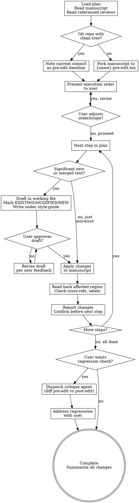

# Manuscript Editing

## Overview

Take a revision plan and collaboratively execute it with the user. Preserves existing prose, drafts new text in working files before applying, and maintains version control safety throughout. This skill handles execution only — critique and planning are done by `manuscript-review`.

## When to Use

- You have a revision plan from `manuscript-review` (in `reviews/YYYY-MM-DD/revision-plan.md`)
- The user provides specific editing instructions or a plan of their own
- Continuing a previously started editing session

## Process Flow

## Workflow

### Step 1: Setup

1. **Load the plan.** Read the revision plan from `reviews/YYYY-MM-DD/revision-plan.md` or from user-provided instructions.
2. **Read the manuscript** and any review documents referenced in the plan.
3. **Version control check:**
   - If the manuscript is in a git repo with a clean working tree: note the current commit SHA as the pre-edit baseline. This enables regression checking via `git diff` at the end.
   - If the manuscript is in a git repo with uncommitted changes: warn the user and ask whether to proceed (changes will be mixed) or commit first.
   - If no git repo: fork the manuscript to `{filename}-pre-edit.{ext}` before making any changes, so the original is preserved.
4. **Present the plan's execution order** to the user. Ask if they want to adjust the order or scope before starting.
5. **Invoke `style-guide` via the Skill tool.** This is mandatory before any drafting or editing begins — it loads the voice principles, blacklist, and Quick Checks that govern all prose produced during the session. Do not skip this step.

### Step 2: Execute Steps in Plan Order

For each step in the plan:

**If the step involves significant new writing or merging content from multiple locations:**

1. **Assembly.** Pull together all the migrating content and draft in a working file (e.g., `reviews/YYYY-MM-DD/{step-name}-draft.tex`). Mark text provenance:
   - `[EXISTING]` — moved verbatim from the current manuscript
   - `[MODIFIED]` — existing text with edits for new context
   - `[NEW]` — new connective text, framing, or transitions

   All `[MODIFIED]` and `[NEW]` text must be written under the `style-guide` voice principles and blacklist loaded during Setup. This means the draft is clean on first presentation — not written sloppily and fixed later.
2. **Review.** Present the draft to the user. Explain what's new vs. moved. Flag any decisions that need user input.
3. **Revise.** Iterate on the draft based on user feedback until approved. Continue writing under `style-guide` for any new or rewritten text in revisions.
4. **Integrate.** Apply the approved draft to the manuscript.
5. **Verify.** Read back the affected region to confirm the edit landed correctly. Check for broken cross-references (`\ref` to removed `\label`s), orphaned content, and formatting issues.

**If the step is a straightforward move, cut, or rearrangement:**

1. **Apply** the change to the manuscript. Moves and cuts of existing prose can proceed more autonomously — the user doesn't need to approve relocating a paragraph verbatim.
2. **Verify.** Read back the affected region. Check cross-references.
3. **Report** what was done.

**Between steps:** Show the user the current state of the affected region, confirm the step is complete, and proceed to the next step only after confirmation.

### Step 3: Completion

After all steps are executed:

1. **Ask the user if they want a regression check.** If yes:
   - Dispatch a critique subagent that compares the pre-edit and post-edit versions of the manuscript.
   - The agent should look for: lost content (present before, absent after, not in recycle file), broken logical connections, new redundancies between sections, tone or voice inconsistencies between new and existing prose, stale cross-references or forward/backward pointers.
   - Present findings to the user. Collaboratively address any regressions.
2. **Summarize** all changes made across the session.

## Guiding Principles

These are baked into the skill's behavior, not suggestions:

1. **Preserve existing prose.** Move and reframe rather than rewrite from scratch. The author's voice matters — match the tone, rhythm, and register of the surrounding text.
2. **Draft before applying.** New or substantially rewritten sections get drafted in working files, reviewed by the user, then integrated. Do not write new paragraphs directly into the manuscript without user review.
3. **Flag provenance.** When drafting, mark what's verbatim, lightly modified, or new so the user can see exactly what changed and focus their review on the new material.
4. **Follow the plan order.** Don't jump around — dependencies between steps matter. If the plan says to create a section before migrating content into it, follow that order.
5. **Collaborate on new text, move existing text autonomously.** The user's time is best spent reviewing new framing and transitions, not watching prose get relocated. Verbatim moves can proceed with a brief report.
6. **Park cut content.** When removing text from the manuscript, move it to a recycle file (e.g., `_recycle_later.tex`) with a comment noting the date and reason, unless the plan says to discard it.

## Rules

1. **Never overwrite without a recoverable baseline.** The version control check at session start is mandatory. If there is no git repo and no pre-edit fork, do not proceed.
2. **Never edit without user approval for new text.** Moves and cuts can proceed autonomously; new prose must be drafted and approved.
3. **Always verify after integrating.** Read back affected regions and check cross-references after every edit.
4. **Invoke `style-guide` before writing any prose.** It must be loaded via the Skill tool during Setup so its voice principles and blacklist govern all `[MODIFIED]` and `[NEW]` text from the moment of drafting. Writing first and checking later is not acceptable.
5. **Save drafts to `reviews/YYYY-MM-DD/`.** Working drafts are artifacts the user may want to reference later.
6. **One step at a time.** Complete and confirm each step before moving to the next.

## Skill Dependencies

- `style-guide` — **must invoke via Skill tool during Setup** before any prose is written or edited
- `manuscript-review` — produces the plans this skill executes (or user provides a plan)

## Common Mistakes

| Mistake | Fix |
|---------|-----|
| Writing new paragraphs directly into the manuscript | Draft in a working file first, get approval, then integrate |
| Rewriting existing prose instead of moving it | Preserve the author's voice — rearrange, don't rewrite |
| Skipping the version control check | Always check before first edit — no recoverable baseline = don't proceed |
| Jumping between plan steps out of order | Follow execution order — dependencies matter |
| Not checking cross-references after edits | Stale `\ref`, `\label`, or section references are easy to miss |
| Applying all changes then asking for review | Review after each step, not at the end |
| Forgetting to park cut content | Move removed text to a recycle file with a dated comment |
| Not flagging provenance in drafts | User needs to see what's new vs. moved to focus their review |
| Drafting prose without invoking `style-guide` first | Invoke via Skill tool during Setup — voice principles must govern writing, not be applied as a post-hoc fix |
