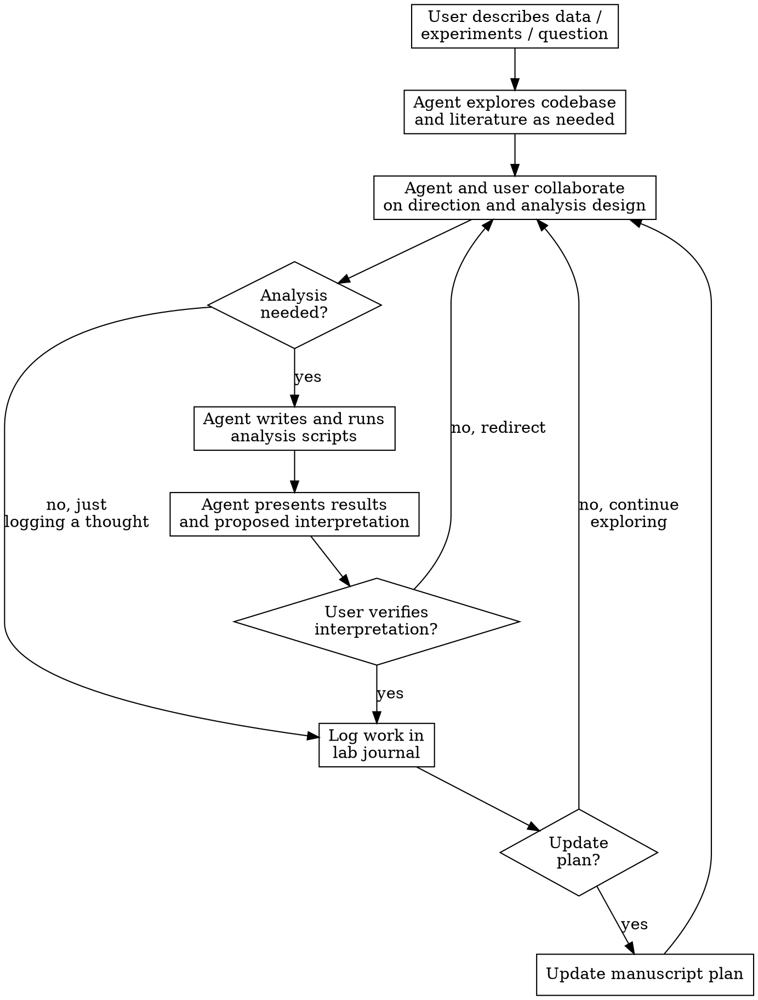

# Manuscript Planning

## Overview

Collaborative dialogue to develop a high-impact manuscript plan. The agent and user work together to identify the strongest questions the data can answer, co-design and run analyses, and organize findings into a compelling narrative — before writing prose.

This skill sits at the interface between the literature database and the codebase. It reads both, runs analyses, and produces two artifacts: a **manuscript plan** and a **lab journal**.

## When to Use

- User has data and wants to figure out the best paper to write
- User wants to explore what questions their dataset can answer
- User needs to structure findings into a manuscript outline
- User wants to iterate on framing, figure order, or narrative arc
- User needs to decide what analyses to run next
- User wants to identify gaps in their story (data, analyses, or literature)

## Artifacts

### Manuscript Plan

The current best outline of the paper. A living document: sections get added, removed, reorganized as thinking sharpens.

- **Format and location are user-specified.** Could be markdown, a section in a `.tex` file, or anything else. Ask the user where they want it and in what form.
- **Default:** `manuscript-plan.md` in the project root.
- **Content style:** Bullet points and short sentences. Not prose. Fast to iterate on.
- Overridable via `CLAUDE.md` or at session start.

### Lab Journal

Append-only record of everything tried: hypotheses, analyses, results, ad hoc thoughts, dead ends, redirections. The institutional memory that prevents retracing steps across sessions.

- **Append-only** — entries are never deleted, only annotated.
- **Freeform** — some entries are structured (hypothesis, analysis, result). Others are a stray thought, a question, a "what if." The journal accommodates both.
- **Keep entries small** — a paragraph or two. If it needs more space, split it.
- **Links to scripts** — when an analysis was run, reference the script path.
- **Notes what made it into the plan and what didn't** — informally.
- **Default:** `lab-journal.md` in the project root. Overridable via `CLAUDE.md`.

Example entries showing the range:

```markdown
# Lab Journal — [Project Name]

## 2026-03-06: Temporal sharpening as central framing

Ran `scripts/tuning_bandwidth_over_time.py` on sessions 1-12. Significant
sharpening in 9/12 sessions (p < 0.01), ~30% bandwidth reduction. Consistent
across animals. Strong support — moved into plan as core result.

## 2026-03-06: Layer-specific differences?

Tried splitting by depth estimate (`scripts/layer_analysis.py`). No significant
difference (p = 0.43), but depth estimates are noisy with these electrodes.
Can't distinguish layers with current data. Might revisit with laminar probes.
Dropped from plan.

## 2026-03-06: Gamma cycle overlap

Ryan mentioned the sharpening timescale (~100ms) overlaps with the gamma cycle.
Worth checking if there's a relationship to LFP oscillations. Haven't looked yet.
```

## Core Loop



**Critical rules:**
- Agent always returns to user for interpretation verification. Agent proposes; user confirms.
- Agent and user co-design analyses before the agent writes code. No surprise batch runs.
- One question at a time during exploratory dialogue.
- When "impact" is unclear, ask the user — don't assume.

## Modes

### Discovery
"Here's my data. What are the strongest questions?" Agent explores the intersection of what the data can show and what the field needs (drawing on literature database). Asks user about target audience/journal.

### Analysis Collaboration
"I think X might be happening." Agent and user co-design the analysis. Agent implements and runs it. User verifies interpretation. Result gets logged.

### Outline Structuring
"I have these findings. How do I structure the paper?" Agent organizes into a narrative arc, suggests figure order, maps findings to sections.

### Gap Identification
"What's missing?" Agent identifies weak claims, missing controls, analyses that would strengthen the story, literature gaps.

### Future Experiments
"What would make this stronger?" Agent suggests experiments to fill gaps or elevate impact.

### Resume
"Where were we?" Agent reads lab journal and manuscript plan, summarizes current state, picks up where things left off.

## Interfacing with the Codebase

- Explore the codebase in response to what the user is asking about — no upfront full scan
- Write analysis scripts using existing code tools
- Run scripts via `uv run` (**REQUIRED:** use `python-environment` skill)
- Use `systematic-debugging` when analyses fail
- Use `test-driven-development` when building analysis pipelines
- Reference scripts in lab journal entries

## Interfacing with the Literature Database

- Read summaries, themes, `index.yaml` to understand field context
- Use `database-search` to find papers relevant to a hypothesis
- When literature gaps are found, hand off to `literature-review`
- Draw on themes to position the manuscript's contribution

## Impact is Negotiated

"Impact" is fuzzy. The agent should:
- Ask the user about target journal and audience early
- Ask what the user considers the most important contribution
- Propose framings with reasoning, but defer to the user
- Revisit impact framing as the story evolves — what seemed most impactful at the start may shift as analyses reveal unexpected results

## Session Start

When invoked, the agent should:

1. Check if a lab journal and manuscript plan already exist
2. If **resuming**: read both artifacts, summarize current state, ask where to pick up
3. If **starting fresh**: ask the user to describe their data, experiments, and what they're thinking about. Ask about target journal/audience. Establish where to save artifacts and in what format.

## Skill Dependencies

- `database-search` — find relevant papers in the literature database
- `literature-review` — hand off when literature gaps are found
- `literature-writer` — hand off when plan is ready for prose
- `python-environment` — all script execution (REQUIRED before running any Python)
- `systematic-debugging` — when analyses fail
- `test-driven-development` — when building analysis pipelines
- `theme-synthesize` — position manuscript relative to existing themes

## Common Mistakes

| Mistake | Fix |
|---------|-----|
| Running analyses without co-designing with user | Always discuss what to run and why before writing code |
| Assuming what's impactful | Ask the user. Revisit as the story evolves |
| Writing prose instead of bullets | The plan is for iterating, not reading. Keep it terse |
| Deleting lab journal entries | Journal is append-only. Annotate abandoned ideas, don't erase them |
| Full codebase scan at session start | Explore as needed in response to user questions |
| Batching many analyses without checking in | One analysis at a time, verify interpretation, then decide next step |
| Forgetting to log work | Every analysis, thought, or decision gets a journal entry |
