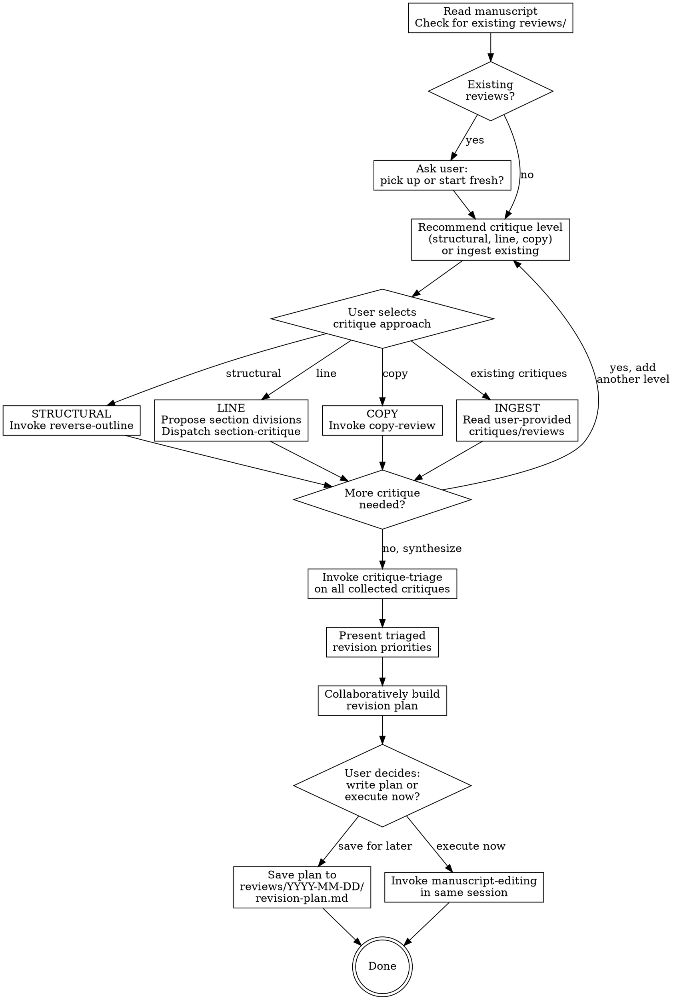

# Manuscript Review

## Overview

Collect critiques of a manuscript from multiple sources and levels, synthesize them into a prioritized revision plan, and either save the plan for later execution or hand off to `manuscript-editing` in the same session. This skill handles critique and planning only — it does not edit the manuscript.

## When to Use

- Reviewing a manuscript draft before submission
- Systematic critique of a paper, grant, or long-form document
- User wants structured feedback on a piece of writing
- User has external reviews (journal comments, collaborator feedback) to synthesize into a plan
- User wants to plan revisions before executing them

## Process Flow

## Workflow

### Session Start

1. Ask the user to point to the manuscript (file path).
2. Read the manuscript.
3. Check for existing `reviews/` directory alongside the manuscript.
   - If reviews exist: ask the user whether to pick up where they left off or start fresh.
   - If starting fresh: create a new `reviews/YYYY-MM-DD/` directory.
4. Recommend a critique level based on the manuscript's state:
   - **Structural:** Best for early drafts or documents that haven't been structurally reviewed.
   - **Line editing:** For documents with sound structure that need section-level argument review.
   - **Copy editing:** For documents with solid content that need polish.
   - **Ingest existing:** If the user already has critiques (journal reviews, collaborator comments, files in `reviews/`).
5. The user selects the approach. The stage hierarchy (structural before line before copy) is a recommendation, not a hard gate — the user decides.

### Critique Collection

Critiques can come from any combination of sources. After each round, ask the user if they want to add another level of critique before synthesizing.

**Structural critique:**
1. Invoke `reverse-outline` on the manuscript (dispatch as subagent).
2. Present the reverse outline and structural critique to the user.

Structural critique is exclusively about architecture: argument flow, logical gaps, section organization, redundancy, and balance. It is NOT about minor issues (typos, grammar, formatting, citation errors). Those belong to later stages.

**Line editing critique:**
1. Propose section divisions. Analyze the manuscript and propose logical divisions that span distinct ideas. These don't need to match the document's section headers. Include the abstract, title, and individual figures/tables as separate reviewable units. Present to the user for confirmation.
2. Dispatch `section-critique` subagents for each confirmed section (in parallel when possible; batch if >10 subagents needed).

**Copy editing critique:**
1. Invoke `copy-review` on the manuscript (dispatch as subagent).

**Ingesting existing critiques:**
1. Read user-provided critique files (from `reviews/` directory, pasted text, or external documents).
2. Parse into the same issue format used by the critique subagents (severity, type, location, description).

### Synthesis

Once all critiques are collected:

1. Invoke `critique-triage` to synthesize and prioritize across all collected critiques.
2. Present the triaged, prioritized results to the user.
   - If triage identifies structural escalations from line-level critiques: flag these and recommend addressing structural issues first.

### Revision Planning

Collaboratively build a revision plan from the triaged critiques. Work through the issues with the user to determine:

- **What changes to make** — which issues to address, which to defer, which to reject
- **Execution order** — what to do first, dependencies between changes (e.g., "create the new section before migrating content into it")
- **Content migration map** — what moves where, what gets cut, what stays
- **Where new text is needed** vs. where existing prose can be rearranged
- **Guiding principles** — preserve tone, minimize rewrites, maintain the author's voice, match specific stylistic qualities of the existing text

### Terminal State

Ask the user:

- **Write plan for later execution:** Save to `reviews/YYYY-MM-DD/revision-plan.md`. The plan document must be self-contained — a fresh session should be able to execute it by reading the plan first, then the linked files, without re-asking the user for context. The plan must include:
  - **Context files section** (at the top of the plan, before anything else): A numbered list of every file the executing session must read, with specific line ranges for each relevant section of the manuscript and pointers to what each file contributes. This includes the manuscript itself (with line ranges for each section affected by the plan), all review documents and critiques that informed the plan, and any external critique files the user provided. The goal is that a fresh session reads this section first and knows exactly what to load.
  - **Author directions section**: A summary of all decisions the user made during the planning conversation — what to keep, what to cut, what to reframe, standing stylistic preferences, and any rationale the user provided. These are the user's instructions to the executing session.
  - The revision plan itself (changes, execution order, migration map, guiding principles)
- **Execute now:** Invoke `manuscript-editing` in the same session, passing the plan.

### Non-Editable Documents

If the manuscript is a non-editable format (PDF, image):
- Follow the same critique and planning workflow.
- The revision plan becomes the primary output, saved to `reviews/YYYY-MM-DD/revision-plan.md`.

## Subagent Dispatch

When dispatching subagents, provide:
1. The full document text (or path for the subagent to read)
2. The specific task (which skill to invoke, what section to focus on)
3. The output path for saving results

For line editing, dispatch section-critique subagents in parallel when possible. If more than 10 subagents would be needed, batch adjacent sections.

## Rules

1. **This skill does not edit the manuscript.** It collects critiques and builds revision plans. Editing is done by `manuscript-editing`.
2. **Always save outputs.** All critique, triage, and plan artifacts go to `reviews/YYYY-MM-DD/`.
3. **User drives the conversation.** The orchestrator recommends; the user decides. This applies to critique level selection, issue prioritization, and plan scope.
4. **Plans must be self-contained.** A fresh session with `manuscript-editing` should be able to execute the plan by reading it first, then the linked context files, without re-asking the user. This means every plan starts with a context files section (paths + line ranges) and an author directions section (all user decisions from the planning conversation).
5. **Recommend the stage hierarchy, don't enforce it.** Structural before line before copy is good advice, not a hard gate. The user may have reasons to start elsewhere.
6. **Escalate when triage says to.** If critique-triage identifies structural escalations during line editing, recommend addressing structural issues before continuing.

## Skill Dependencies

- `reverse-outline` — structural analysis (dispatched as subagent)
- `section-critique` — adversarial section critique (dispatched as subagent, potentially in parallel)
- `critique-triage` — synthesis and prioritization (dispatched as subagent or inline)
- `copy-review` — copy editing critique (dispatched as subagent)
- `manuscript-editing` — executes revision plans (invoked at terminal state, or in a separate session)

## Common Mistakes

| Mistake | Fix |
|---------|-----|
| Editing the manuscript directly | This skill plans; `manuscript-editing` executes |
| Enforcing rigid stage order | Recommend the hierarchy, but let the user choose |
| Writing a plan that requires context not in the document | Plans must open with a context files section (paths + line ranges) and author directions section (all user decisions) |
| Jumping to plan-building before synthesizing critiques | Always triage first to deduplicate and prioritize |
| Ignoring structural escalations from triage | If triage says structure is broken, flag it prominently |
| Not checking for existing reviews | Always check on session start — offer to resume |
| Mixing critique with revision planning | Collect all critiques first, then synthesize, then plan |
